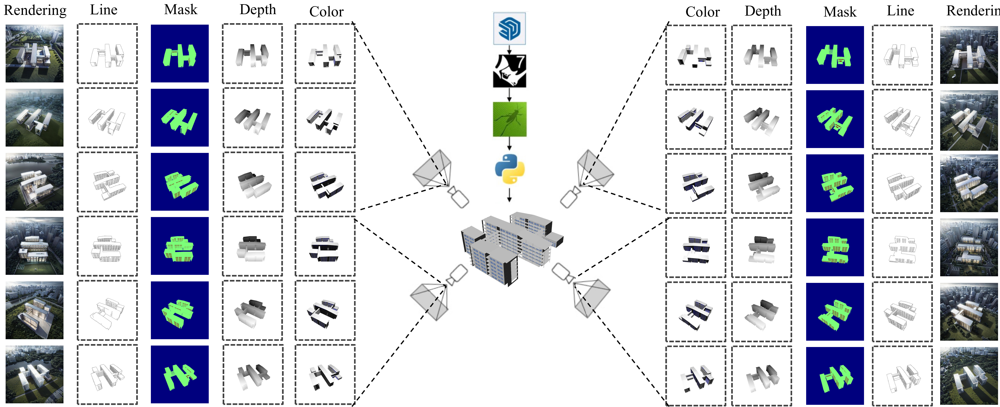

# \[ICCV 25\] ArchiSet: Benchmarking Editable and Consistent Single-View 3D Reconstruction of Buildings with Specific Window-to-Wall Ratios

## Abstract

Image-based 3D reconstruction has made significant progress in typical scenarios, achieving high fidelity in capturing intricate textures. However, in the Architecture, Engineering, and Construction (AEC) design stages, existing technologies still face considerable challenges, particularly in handling specific window-to-wall ratios, ensuring window detail consistency, and enabling interactive editing. To address this research gap and encourage greater community attention on this practical architectural design problem, we propose a new task: Editable and Consistent Single-View 3D Reconstruction of Buildings with Specific Window-to-Wall Ratios. To accomplish this: 
1) We introduce the ArchiSet dataset, the first public, real-world architectural design dataset, including 13,728 3D building forms in the format of point clouds, voxels, meshes, and window-to-wall ratio information, providing comprehensive support for 3D architectural design research. The dataset also contains over 1,482,624 images in three types—sketches, color block diagrams, and renderings—accompanied by paired window masks for detailed evaluation. 
2) We evaluated state-of-the-art single-view 3D reconstruction algorithms on ArchiSet, identifying several limitations, such as the loss of volumetric detail, incomplete window details, and limited editability. 
3) We introduce BuildingMesh, a diffusion model specifically designed for generating and editing 3D architectural forms from a single image with customizable window-to-wall ratios, suitable for dynamic architectural design workflows. We propose an regularized method to ensure window consistency. Our framework also includes an interactive module for easy further editing, enhancing platform efficiency and accuracy in professional architectural design workflows. Experimental results demonstrate that BuildingMesh achieves high-quality 3D generation with improved design flexibility and accuracy.

## Overview of ArchiSet Dataset

This dataset includes 13,728 SketchUp models of office buildings created by 243 architecture students (106 undergraduates, 115 postgraduates and 12 PhD students), with a total of 1,482,624 corresponding images, along with window masks and  the Window-to-Wall Ratio (WWR), covering a wide diversity of architectural forms. The level of detail in the 3D assets of this dataset surpasses that of the BuildingGan and RealCity3D datasets, and it significantly exceeds BuildingNet in quantity, deign richness, practical value and WWR information, positioning it as a potential new benchmark for 3D architectural generation tasks.

## Overview of *BuildMesh*

*BuildMesh* is a three-stage 3D building reconstruction method consisting of the following steps:
- generating multi-view window textures from a single-view image with a 2D diffusion model and window ratio as a condition
- propagating local edits across views
- reconstructing high-quality 3D mesh from multi-view images.

The figure provides an overview of *BuildMesh*.

## Editing Examples

Edit with natural language instructions:

Edit with pre-set Window-to-Wall Ratio:

## Experimental Results

We have tested out method on the various benchmarks. Compared with state-of-the-art methods, *BuildMesh* has much-improved reconstruction quality. Compared to Shap-E, Point-E, Wonder3D, and PC2, *BuildMesh* reduced the CD by 44.4\%, 45.4\%, 38.1\%, and 3.03\%, respectively, and increased the F-Scores by 31.5\%, 112.2\%, 34.1\%, and 4.35\%. For the window-to-wall ratio,  *BuildMesh* has achieved relative errors of 3.24\%, 8.89\%, and 9.32\% on the *WS*, *WR*, and *WL* subsets, respectively.

Results on WL subset:
|  Method  | Chamfer Distance (CD) $\downarrow$ | F-score $\uparrow$| Fréchet Point Distance (FPD) $\downarrow$ | 
|:---------:|:-------:|:------:|:-----:|
Shap-E     | 0.1652 | 0.4934 | 0.1358
Point-E    | 0.1685 | 0.3180 | 0.1147
Wonder3D   | 0.1637 | 0.5403 | 0.1552
One-2-3-45 | 0.0879 | 0.5827 | 0.0534
PC2        | 0.0848 | 0.6634 | 0.0477
**Ours**       | **0.0832** | **0.6835** | **0.0435**

Results on WS subset:
|  Method  | Chamfer Distance (CD) $\downarrow$ | F-score $\uparrow$| Fréchet Point Distance (FPD) $\downarrow$ | 
|:---------:|:-------:|:------:|:-----:|
Shap-E     | 0.1247 | 0.5835 | 0.0820
Point-E    | 0.1558 | 0.3251 | 0.1013
Wonder3D   | 0.1117 | 0.5664 | 0.1238
One-2-3-45 | 0.0969 | 0.6530 | 0.0532
PC2        | 0.0826 | 0.6740 | 0.0460
Ours       | 0.0768 | 0.7396 | 0.0428

Results on WR subset:
|  Method  | Chamfer Distance (CD) $\downarrow$ | F-score $\uparrow$| Fréchet Point Distance (FPD) $\downarrow$ | 
|:---------:|:-------:|:------:|:-----:|
Shap-E     | 0.1492 | 0.5424 | 0.1007 
Point-E    | 0.1796 | 0.3038 | 0.1308 
Wonder3D   | 0.1842 | 0.5275 | 0.1838 
One-2-3-45 | 0.1292 | 0.6135 | 0.0538 
PC2        | 0.0827 | 0.6824 | 0.0462 
Ours       | 0.0816 | 0.7259 | 0.0454